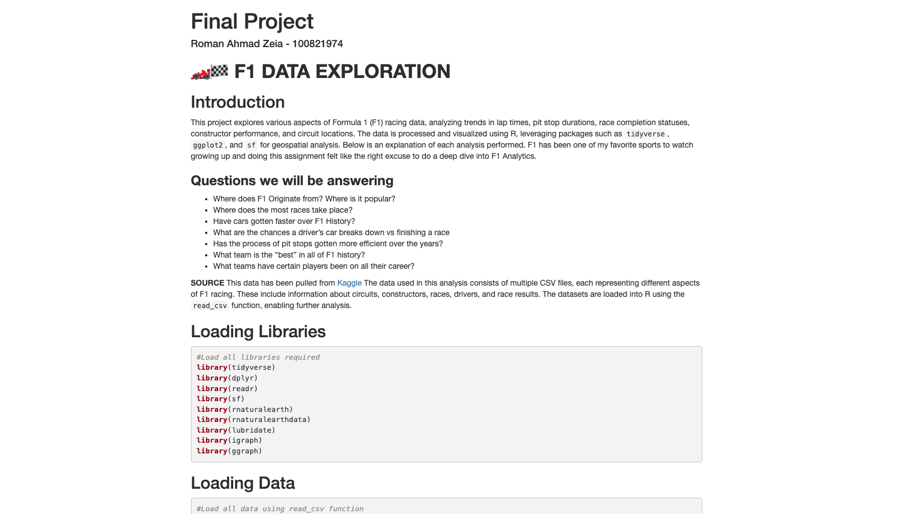

# F1 Data Exploration
## By: Roman Ahmad Zeia
Open the html file inside the repository to view the analysis or execute the .rmd file to view the code written in R 
This project does a deep dive into F1 Data from 1950 - 2024 by exploring and answering questions through meaningful visualizations.

